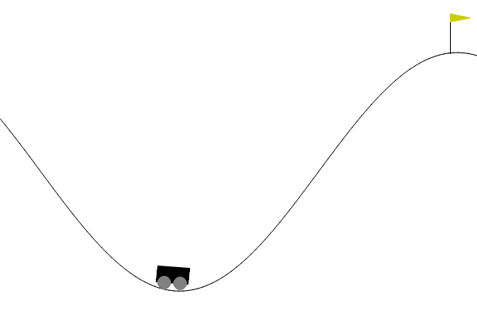
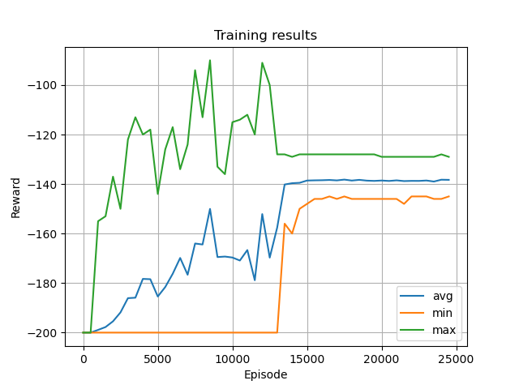

# MountainCar example

Mountain car environment, provided by Gym library simulates a classic reinforcement learning problem. The goal is to climb a hill to reach the flag.

To solve the problem, QLearning algorithm was used. It require to discretize the envirenment first.

An example on trained strategy

Results of training with average revards

 

